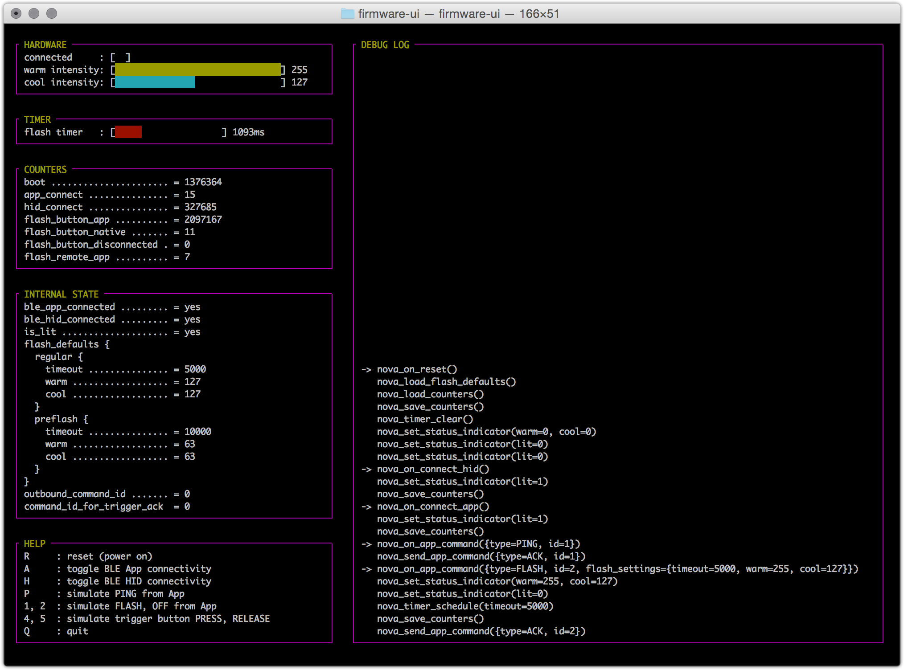

Nova Fake Firmware User interface
=================================

This is a standalone program that embeds the Nova shared firmware code
but wires it up to a fake device (in memory, instead of real hardware)
and provides a user interface for viewing and interacting with it.

Use it to manually interact with the shared firmware code and see
how it responds.

Screenshot
----------

Fake device
-----------

Under the hood, it implements a fake Nova device that simply stores things
in memory rather than interacting with real peripherals.

See `fake-nova-device.h` and `fake-nova-device.c`.

Linux / OS X only
-----------------

This uses the text base [ncurses](http://en.wikipedia.org/wiki/Ncurses) library
to build the UI. This won't work on Windows.

If Windows support is needed, it should be easy to replace the code in `ui.c`
with something that uses another GUI kit.

Terminal problems after exit
----------------------------

When the program exits gracefully it should restore your terminal. However
if it exits abnormally (kill -9, crash, etc) you may not be able to see what
you type in the terminal. To fix this:

    $ reset

----

*(c) 2015, Joe Walnes, Sneaky Squid*
